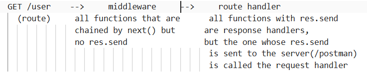

- Create backend/Node repository
- Initialise the Repo(npm init)
- node_modules, package.json, package-lock.json, versioning(major.minor.patch), ^ vs ~
- create src/App.js
- create a server(express/mongo)
- listen to port 3000
- write request handlers to defined routes and send response from the server
- install nodemon(auto run the server on save)
  when we install nodemon -g will install globally but if we haven't installed using sudo cmd(sudo npm i -g nodemon) you will have to set the PATH variable as below, else the nodemon is not set to access though installed globally.// npm i -g nodemon
  // Source - https://stackoverflow.com/a/17976504

      C:\>npm config get prefix
      C:\Users\<username>\AppData\Roaming\npm

      C:\>set PATH=%PATH%;C:\Users\<username>\AppData\Roaming\npm;

      C:\>nodemon
      31 Jul 22:30:29 - [nodemon] v0.7.8
      31 Jul 22:30:29 - [nodemon] to restart at any time, enter `rs`
      31 Jul 22:30:29 - [nodemon] watching: C:\
      31 Jul 22:30:29 - [nodemon] starting `node `
      ^CTerminate batch job (Y/N)? Y

- update package.json scripts with dev and start commands - "scripts": {
  "dev": "nodemon src/App.js",// auto restart on save
  "start": "node src/App.js",// manually restart the server
  },

---

- initialize git (git init)
- add .gitignore file and update with files that should not be committed. (node_modules)
- write sample request handlers for different routes(/, /test, /login, /hello)
- - Order of placing the request handlers matters a lot.

  app.listen(3000, () => {
  console.log("Server is running on port 3000");
  });
  app.use("/", (req, res) => {
  res.send("Sample route");
  });
  app.use("/login", (req, res) => {
  res.send("Login route");
  });
  app.use("/hello", (req, res) => {
  res.send("Hello route");
  });
  - here the server listening on port 3000 will return same response for different routes though they are present in the request handlers or not. i.e., "Sample route" is the output for localhost:3000/login (OR) localhost:3000/login1211 (OR) localhost:3000/hello (OR) localhost:3000/xyz (OR) localhost:3000/ (THE ACTUAL ROUTE WITH RESPONSE "Sample route")
  - But below order or Routes work perfectly bcz it matches the route path sequentially and returns the response. '/' acts as a wild card and would work for any route.

    app.use("/login", (req, res) => {
    res.send("Login route");
    });
    app.use("/hello", (req, res) => {
    res.send("Hello route");
    });
    app.use("/", (req, res) => {
    res.send("Sample route");
    });

- stage all files changed that needs to be commited. git commit -m "<COMMIT_MESSAGE>"
- create git repo (Dev-Tinder)
  git remote add origin https://github.com/mpokala-dev/Dev-Tinder.git
  git branch -M main
  git push -u origin main
- install Postman app and make a Workspace(Dev-Tinder) > create a Collection(Test API calls) > create a HTTP request(GET Test)
- Write logic to handle GET, POST, PATCH, DELETE, API calls and test them on Postman

- Explore routing ?, \* , +, ( ), : (for dynamic routing), regex
  --> express v5 doesnot allow route path containing spl characters, so it suggest to use regex in place of string formatted route path.
  --> for dynamic routing try to simplify the route by using route path as string
- request.query (to know the query from the url, ex: localhost:3000/?userid=1001 => request.query will log {user: '1001'})
- request.params (app.get("/user/:userID", (req, res)=>{}); => localhost:3000/user/1001 => {userID: '1001'})

---

- Multiple route handlers
- next()
- next() and errors along with res.send()
- array representation of rout handlers.

  app.use('route',[rh1, rh2, rh3 ....])
  === app.use('route', rh1, [rh2, rh3], rh4...)
  === app.use('route', rh1, rh2, [rh3], rh4...)
  === app.use('route', rh1, rh2, rh3, rh4...)

- What is a Middleware? Why do we need it?
- How express.js handles request behind the scenes
  GET /user --> middleware --> route handler
  

- Difference between app.use and app.all

  app.use() = "Use this middleware for every matching request."
  app.all() = "Accept all HTTP methods for this specific route."

- Write a dummy middleware for admin authorization
- Write a dummy middleware for user authorization excluding user/login
- Error handling with try catch block and err as a parameter in the route handler

---

- Create a free cluster on MongoDB official website (Mongo Atlas) // Node-dev is the cluster already created with database HelloWorld. For this project we shall create a seperate database.
- Install mongoose library // mongoose establishes connection between the server and the mongoDB cluster
- create config folder to maintain the database connections.
- Connect your application to the <b>Database</b> "(cluster)connection-url"<b>/devTinder</b>
- Call the connectDB function and connect to database before stating to listen the application on port 3000.
- create a userSchema for User in the models folder.
- create POST /signup api call
- push some documents to the database with using API call from Postman
- Always do error handling whenever handling API calls to the database

- JS object vs JSON
- Add the express.json middleware to your app.js
- Make your signup API dynamic to receive data from the end user(req.body)
- User.findOne with duplicate documents(ex: duplicate first name or duplicate email..) --> which document is returned??
- GET /users API by email/name
- Feed API - GET /users/feed - get all the users (User.find({})) from the database.
- Create an API GET user/:id -> User.getById()

- Create a DELETE API by id --> User.findByIdAndDelete()
- Create an UPDATE API by id --> User.findByIdAndUpdate() == findOneAndUpdate()[only difference is it can take any key param not just id]
- explore options param in findByIdAndUpdate()
- explore the Mongoose documentation for Model specifically
- update the user details by referencing it to the email id from the request params.(findOneAndUpdate({condition}, update, {options}))

- add appropriate schema validations
  - required,
  - unique,
  - trim(Mongoose's trim: true only removes leading and trailing whitespace.),
  - min(only for type: Number),
  - minlength,
  - maxlength,
  - set(returns the value and sets as per the condition),
    -- set: value => value.replace(/\s+/g, "")
  - match(validate as per the regex )
    -- match: [/^\S+@\S+\.\S+$/, "Please enter a valid email address"]
  - default
  - enum

- Add timestams: true as a second argument to the user Schema so that createdAt and updatedAt timestams are automatically maintained in the MongoDB
